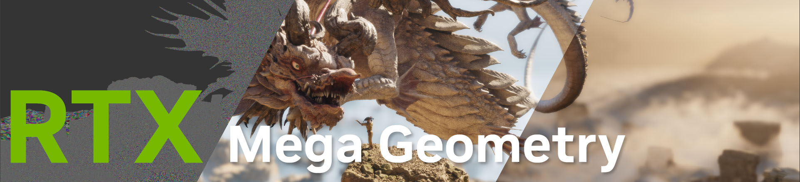

# RTX Mega Geometry



<br/>
<div align="center">
·
<a href="CHANGELOG.md">Change Log </a>
·
<a href="docs/QuickStart.md">Quick Start</a>
·
</div>
<br/>

## Overview

RTX Mega Geometry (RTX MG) is a DX12 and Vulkan code sample that shows how to quickly
build ray-tracing acceleration structures for subdivision surfaces with structured
clusters. It contains a reference HLSL path tracing demo app that can be used as a
learning tool to begin integration with your own graphics engine.

## Features

* Real-time adaptive sampling of Catmull-Clark limit surfaces
* Structured cluster tessellation and displacement mapping
* BVH build with cluster templates using NVAPI for DXR, and the VK_NV_cluster_acceleration_structure extension for Vulkan.
* Hierarchical Z-buffer for reducing tessellation rate of non-primary ray geometry
* DLSS Ray Reconstruction denoising

## Requirements

To Run:
- Windows 10
- NVIDIA RTX GPU (10 GB VRAM or greater)
- GeForce Game Ready Driver 570 or later
- DirectX Raytracing 1.1 API or later

To Build:
- CMake v3.31+
- Windows 10 SDK 10.0.20348.0 or later
- MSVC Compiler 19.43.34810 (Visual Studio 2022 17.13) or later
- For Windows: DirectX 12 AgilitySDK will be fetched automatically
- For Vulkan: Vulkan SDK 1.4.313 or later

## Folder Structure

|           |                                                                      |
| -	        | -                                                                    |
| /bin      | default CMake folder for binaries and compiled shaders               |
| /build    | default CMake folder for build files                                 |
| /external	| external submoduled libraries and SDKs, including osd_lite and donut |
| /assets   | models, textures, scene files (git submodule)                        |
| /rtxmg    | **RTX Mega Geometry core**                                           |

## Build

At the moment, only Windows builds are supported.

1. Clone the repository **with all submodules recursively**:
   
   `git clone --recurse-submodules https://github.com/NVIDIA-RTX/rtxmg.git`

2. Use CMake to configure the build and generate the project files.
   
   ```
   cd rtxmg
   cmake CMakeLists.txt -B ./build
   ```

   Use `-G "some tested VS version"` if specific Visual Studio or other environment 
   version required. Make sure the x64 platform is used. 

3. Build the solution generated by CMake in the `./build/` folder.

   For example, if using Visual Studio, open the generated solution `build/rtxmg.sln` 
   and build it.

4. Select and run the `rtxmg_demo` project. Binaries get built to the `bin` folder. 
   Media assets are loaded from the `assets` folder.


 ## User Interface

Once the application is running, most of the SDK features can be accessed via the
UI window on the left hand side. The UI is self-documenting : hover the mouse over
widgets to read tool-tips. See the <a href="docs/QuickStart.md">Quick Start guide</a>
for more details.

Camera can be moved using W/S/A/D keys and rotated by dragging with the left mouse
cursor.  Holding the Alt key and left-click dragging will orbit the camera around
the scene's center.

## Command Line

- `-mf` loads a specific .scene.json or OBJ file; 
  example: `-mf programmer-art.scene.json`
- `-d` to enable the graphics API debug layer or runtime, 
  and the [NVRHI](https://github.com/NVIDIA-RTX/NVRHI) validation layer.
 
Additional command line flags can be found by running with the `-h` flag.

## Contact

RTX Mega Geometry is under active development. Please report any issues directly
through GitHub issue tracker, and for any information, suggestions or general 
requests please feel free to contact us at rtxmg-sdk-support@nvidia.com

## Related RTX Mega Geometry Repositories

Vulkan
 * [vk_animated_clusters](https://github.com/nvpro-samples/vk_animated_clusters) :
   `VK_NV_cluster_acceleration_structure` for animated content.
 * [vk_tessellated_clusters](https://github.com/nvpro-samples/vk_tessellated_clusters) :
   adaptive triangle tessellation and displacement using `VK_NV_cluster_acceleration_structure`
 * [vk_lod_clusters](https://github.com/nvpro-samples/vk_lod_clusters) :
   cluster-lod system and streaming using `VK_NV_cluster_acceleration_structure`
 * [vk_partitioned_tlas](https://github.com/nvpro-samples/vk_partitioned_tlas)
   update the TLAS of large dynamic scenes with `VK_NV_partitioned_acceleration_structure`

Tools
 * [nv_cluster_builder](https://github.com/nvpro-samples/nv_cluster_builder) 
   spatial clustering algorithms for triangle meshes (C++ library)
 * [nv_cluster_lod_builder](https://github.com/nvpro-samples/nv_cluster_lod_builder)
   continuous level of detail (LOD) for triangle meshes (C++ library)

## Citation
If you use RTX Mega Geometry in a research project leading to a publication, 
please cite the project.

BibTex:
```bibtex
@online{RTX MG,
   title   = {{{NVIDIA}}\textregistered{} {RTX Mega Geometry}},
   author  = {{NVIDIA}},
   year    = 2025,
   url     = {https://github.com/NVIDIA-RTX/rtxmg.git},
   urldate = {2025-02-06},
}
```

## Known Issues

1. The RTX MG SDK does not currently support unstructured clusters or rasterization.

## License

See [LICENSE.txt](LICENSE.txt)

This project includes NVAPI software. All uses of NVAPI software are governed by the license terms specified here: https://github.com/NVIDIA/nvapi/blob/main/License.txt.
