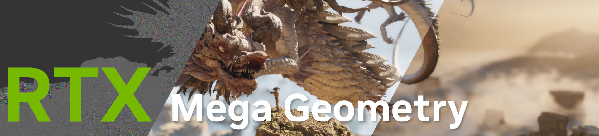
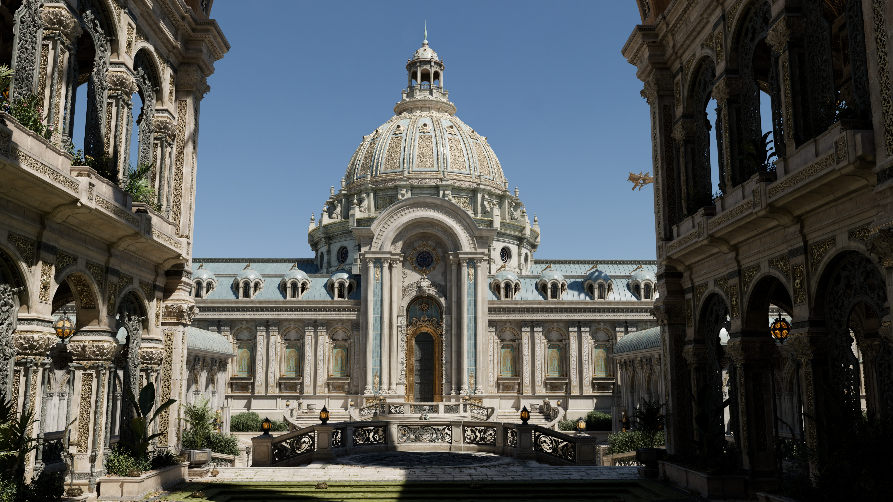
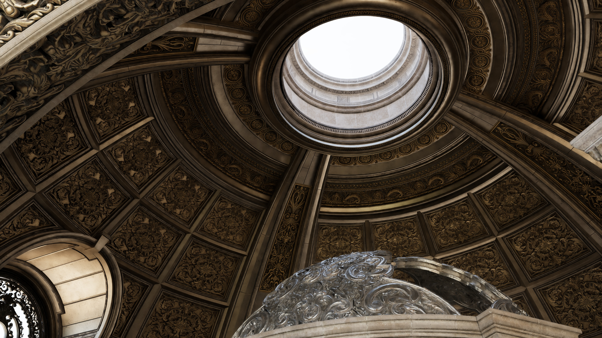
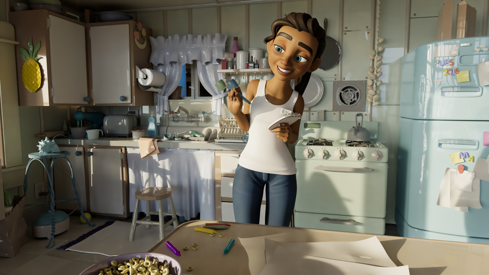
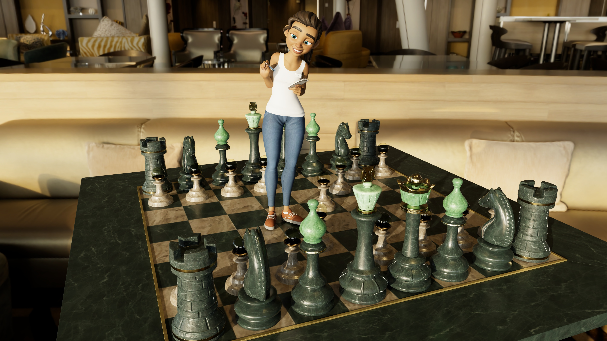

# RTX Mega Geometry



<br/>
<div align="center">
·
<a href="CHANGELOG.md">Change Log </a>
·
<a href="docs/QuickStart.md">Quick Start</a>
·
</div>
<br/>

<div align="center">



<strong>Zorah courtyard (RTX 5090 · 4K @ DLSS Quality)</strong> <br/>
15.5 ms/frame | 56M unique, 778M instanced triangles | 1.5 GB Resident Mesh | 2.3 GB CLAS 

</div>

## Overview

RTX Mega Geometry (RTX MG) is a DX12 and Vulkan code sample that shows how to 
build ray-tracing acceleration structures for high density geometry via dynamic
tessellation of subdivision surfaces and streaming of pre-baked triangle clusters. It
contains a reference HLSL path tracing demo app that can be used as a learning tool to
begin integration with your own graphics engine.

The sample demonstrates **two geometry paths** in one renderer:

* **[Cluster LOD](docs/ClusterLOD.md)** — pre-baked triangle clusters are selected per
  frame from a continuous LOD hierarchy and streamed into VRAM on demand.
* **[Cluster tessellation](docs/ClusterTess.md)** — Catmull-Clark subdivision surfaces
  are tessellated and displaced on the fly, and their acceleration structure is rebuilt
  every frame from cluster templates.

The two paths share one material table, one TLAS and one scene graph, and a single
scene may use both.

## Features

* Real-time adaptive sampling of Catmull-Clark limit surfaces
* Tessellation of subdivision surfaces into clusters and displacement mapping
* Continuous cluster LOD with on-demand geometry streaming, for scenes
  whose source geometry does not fit in VRAM
* BLAS sharing, caching and merging to keep acceleration-structure build cost flat as
  instance counts rise
* Cluster BVH build using NVAPI for DX12, and the VK_NV_cluster_acceleration_structure extension for Vulkan.
* Hierarchical Z-buffer for reducing detail in occluded geometry
* DLSS-RR (Ray Reconstruction) denoising and upscaling

## Running the Sample

Run `rtxmg_demo.exe` from the `bin` folder. Model paths are relative to `assets/` unless
given in full.

### Zorah (Cluster LOD)



**Zorah Textured glTF** is an export of the NVIDIA RTX Kit sample with 1.6 billion unique triangles (18.9 billion instanced), 2034 meshes, 4357 textures. It renders on the [Cluster LOD](docs/ClusterLOD.md) path.

[zorah_textured_public.v1.7z](https://developer.download.nvidia.com/ProGraphics/nvpro-samples/zorah_textured_public.v1.7z)
(70 GB download; 31 GB mesh data + 48 GB textures when extracted)

```
rtxmg_demo.exe -mf <path>/zorah_textured_public.v1.scene.json
```

> [!NOTE]
> The first load bakes the LOD hierarchy for all 2,852 geometries in parallel and can
> require up to 64 GB of RAM at peak. The bake automatically caps its worker thread
> count based on available memory; pass `--bake-workers <n>` to set it explicitly.
> Each geometry shard is checkpointed on completion, so the bake can be interrupted
> and will resume from where it left off on the next launch.

### Amy Kitchen Set (Cluster Tessellation)



A subdivision-surface scene with displacement mapping, tessellated every frame on the
[Cluster Tessellation](docs/ClusterTess.md) path.

```
rtxmg_demo.exe -mf subdivision/amy_kitchenset.scene.json
```

### Amy A Beautiful Game (Combined)



Both geometry paths in one scene, sharing a single material table, scene graph and TLAS.

```
rtxmg_demo.exe -mf subdivision/amy_abeautifulgame.scene.json
```

Once a scene is up, the [Quick Start guide](docs/QuickStart.md) covers camera controls,
the UI panels, the Inspector, the Profiler, and the VRAM Budget window; see
[User Interface](#user-interface) below for the short version.

## Requirements

To Run:
- Windows 10
- NVIDIA RTX GPU (10 GB VRAM or greater)
- GeForce Game Ready Driver 570 or later
- DirectX Raytracing 1.1 API or later

The Cluster LOD path sizes its pools from fixed budgets: 2048 MB of streamed geometry
and 2048 MB of CLAS by default, plus a 4096 MB material-texture budget
(`--texture-budget-mb`). All three are adjustable in the VRAM Budget window — lowering
any of them trades detail for VRAM rather than failing to load. See
[ClusterLOD.md — Streaming budgets](docs/ClusterLOD.md#streaming-budgets).

To Build:
- CMake v3.31+
- Windows 10 SDK 10.0.20348.0 or later
- MSVC Compiler 19.43.34810 (Visual Studio 2022 17.13) or later
- For Windows: DirectX 12 AgilitySDK will be fetched automatically
- For Vulkan: Vulkan SDK 1.4.313 or later

## Folder Structure

|                       |                                                                      |
| -	                    | -                                                                    |
| /bin                  | default CMake folder for binaries and compiled shaders               |
| /build                | default CMake folder for build files                                 |
| /extern               | external submoduled libraries and SDKs, including osd_lite and donut |
| /assets               | models, textures, scene files (git submodule)                        |
| /rtxmg                | **RTX Mega Geometry core**                                           |
| /rtxmg/subdivision    | Catmull-Clark topology, subdivision plans, limit-surface evaluation  |
| /rtxmg/cluster_tess   | the cluster tessellation path — tiling, fill, CLAS templates         |
| /rtxmg/cluster_lod    | the Cluster LOD path — baking, streaming, LOD traversal, BLAS reuse  |
| /rtxmg/scene          | scene graph, materials, texture loading and budgeting                |
| /rtxmg/hiz            | Hierarchical Z-buffer, shared by both paths                          |
| /demo                 | the `rtxmg_demo` reference application and its shaders               |
| /docs                 | quick start, algorithm guides, debugging guide, images               |

## Build

At the moment, only Windows builds are supported. Both the D3D12 and the Vulkan
back-end are supported there; pass `-vk` to run on Vulkan.

1. Clone the repository **with all submodules recursively**:
   
   `git clone --recurse-submodules https://github.com/NVIDIA-RTX/rtxmg.git`

2. Use CMake to configure the build and generate the project files.
   
   ```
   cd rtxmg
   cmake CMakeLists.txt -B ./build
   ```

3. Build the solution generated by CMake in the `./build/` folder.

   For example, if using Visual Studio, open the generated solution `build/rtxmg.sln` 
   and build it.

4. Select and run the `rtxmg_demo` project. Binaries get built to the `bin` folder. 
   Media assets are loaded from the `assets` folder.


 ## User Interface

Once the application is running, most of the SDK features can be accessed via the
UI window on the left hand side. The UI is self-documenting : hover the mouse over
widgets to read tool-tips. See the <a href="docs/QuickStart.md">Quick Start guide</a>
for more details.

Camera can be moved using W/S/A/D keys and rotated by dragging with the left mouse
cursor.  Holding the Alt key and left-click dragging will orbit the camera around
the scene's center.

## Contact

RTX Mega Geometry is under active development. Please report any issues directly
through GitHub issue tracker, and for any information, suggestions or general 
requests please feel free to contact us at rtxmg-sdk-support@nvidia.com

## Related RTX Mega Geometry Repositories

Vulkan
 * [vk_animated_clusters](https://github.com/nvpro-samples/vk_animated_clusters) :
   `VK_NV_cluster_acceleration_structure` for animated content and general introduction to the new extension
 * [vk_tessellated_clusters](https://github.com/nvpro-samples/vk_tessellated_clusters) :
   adaptive triangle tessellation and displacement using `VK_NV_cluster_acceleration_structure`
 * [vk_lod_clusters](https://github.com/nvpro-samples/vk_lod_clusters) :
   The source for this SDK's implementation of
   [Cluster LOD](docs/ClusterLOD.md) — LOD system and streaming using
   `VK_NV_cluster_acceleration_structure`.
 * [vk_partitioned_tlas](https://github.com/nvpro-samples/vk_partitioned_tlas)
   update the TLAS of large dynamic scenes with `VK_NV_partitioned_acceleration_structure`

## Citation
If you use RTX Mega Geometry in a research project leading to a publication, 
please cite the project.

BibTex:
```bibtex
@online{RTX MG,
   title   = {{{NVIDIA}}\textregistered{} {RTX Mega Geometry}},
   author  = {{NVIDIA}},
   year    = 2025,
   url     = {https://github.com/NVIDIA-RTX/rtxmg.git},
   urldate = {2025-02-06},
}
```

## License

See [LICENSE.txt](LICENSE.txt)

This project includes third-party software, and fetches and downloads more of it
at configure time. Each component remains under its own licence; they are listed
in [notice.txt](notice.txt).
