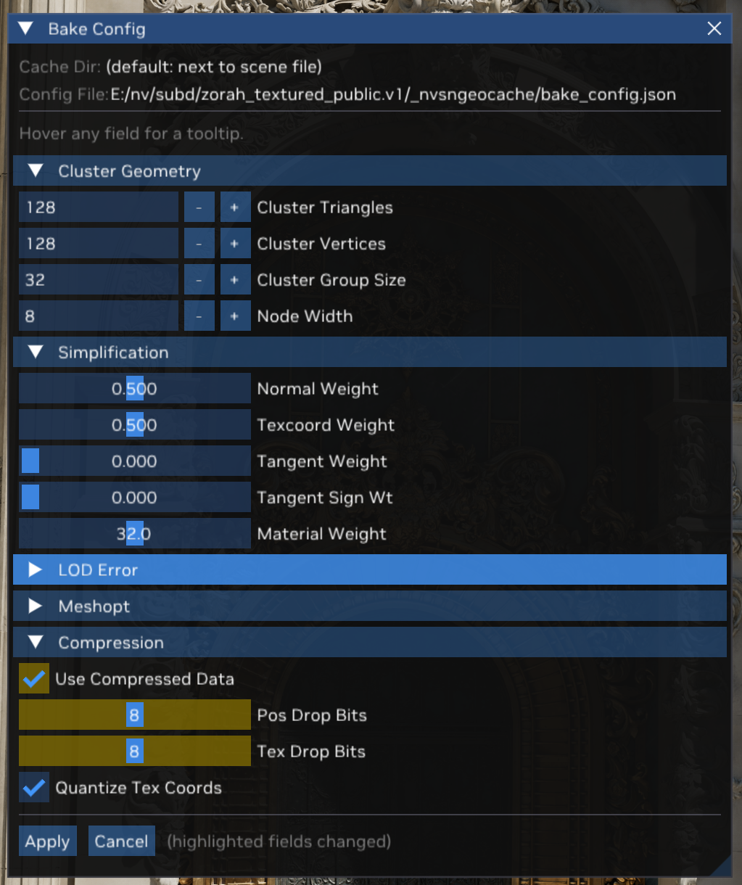
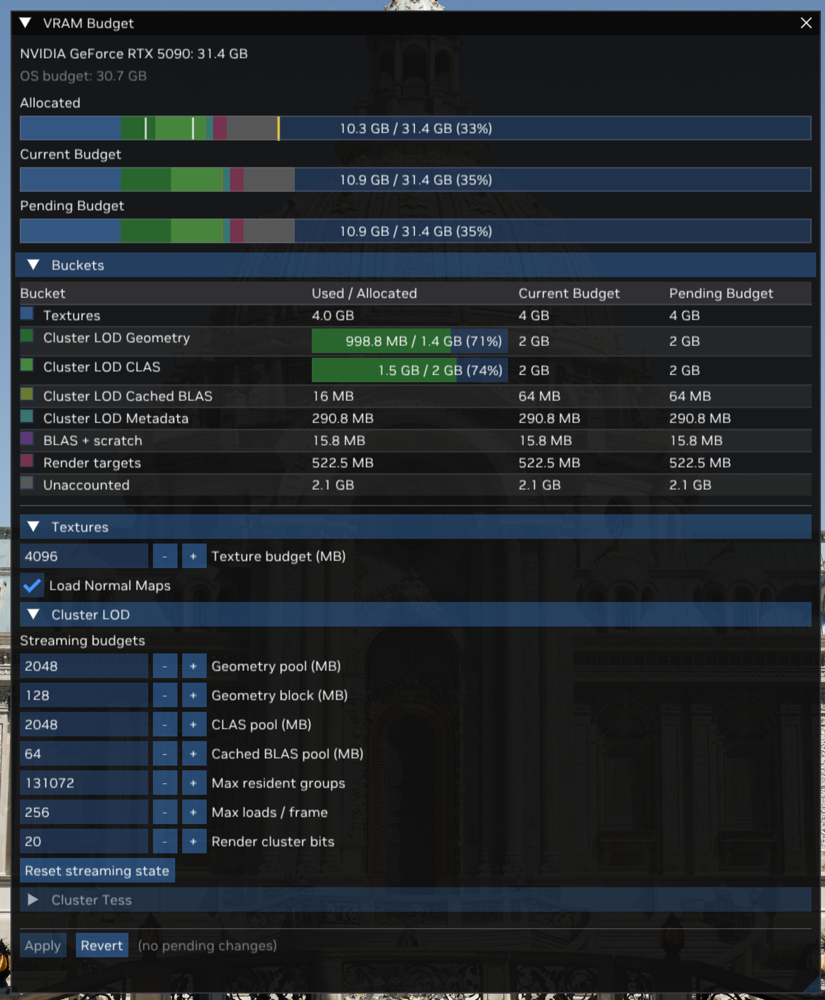
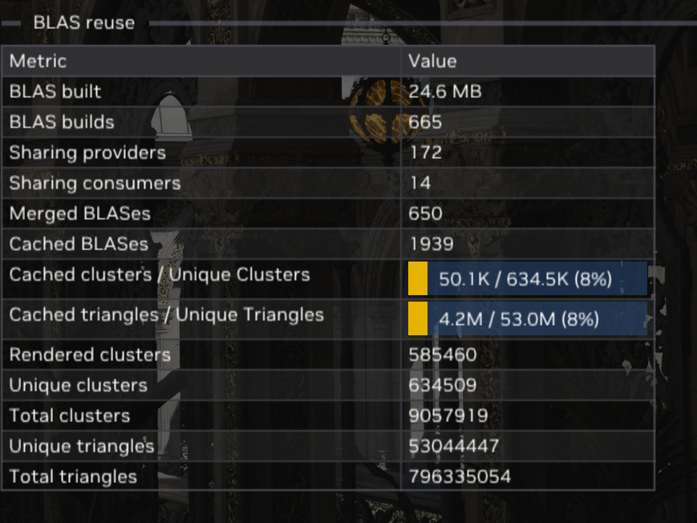
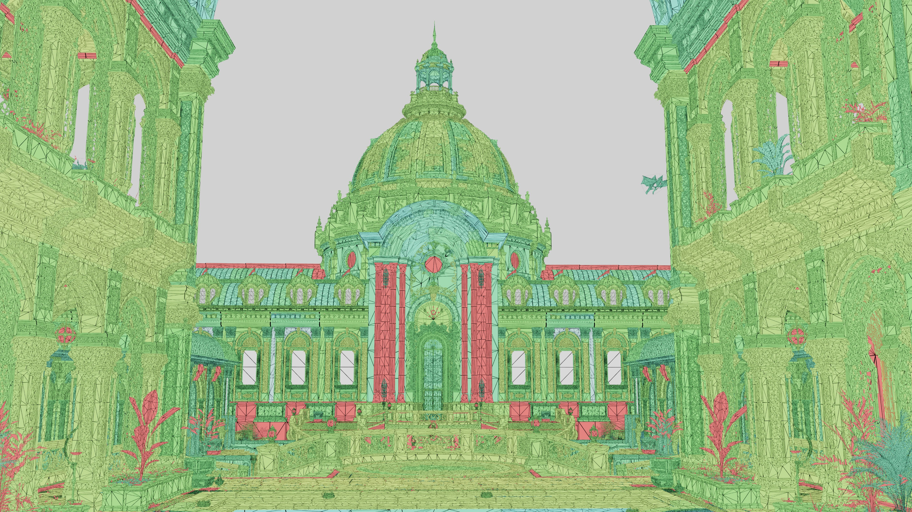
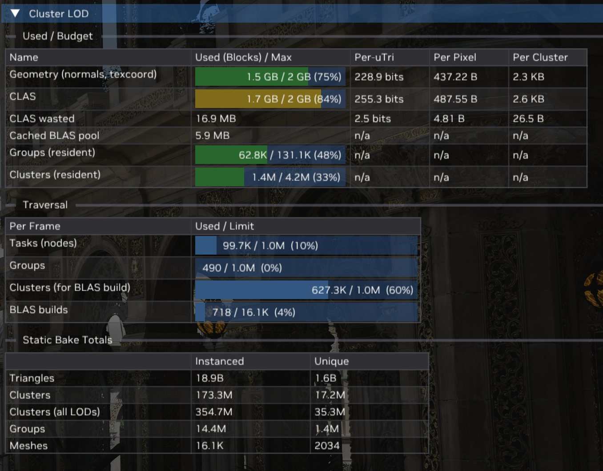
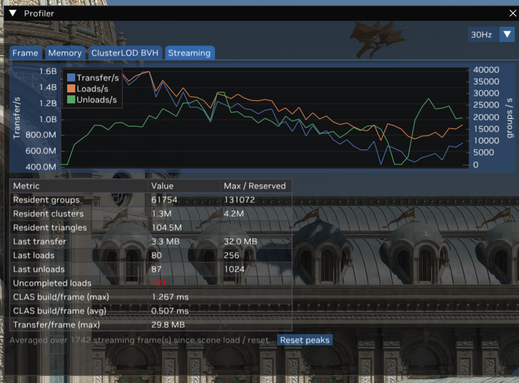
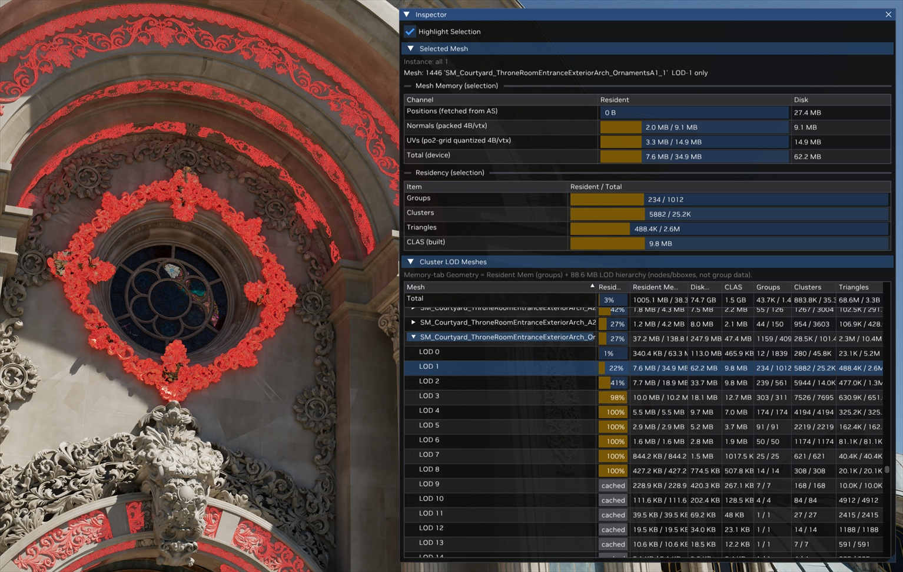

# Cluster LOD

## Introduction
RTX MG's Cluster LOD path is a D3D12 and Vulkan port of
[vk_lod_clusters](https://github.com/nvpro-samples/vk_lod_clusters), brought to both
APIs through [NVRHI](https://github.com/NVIDIA-RTX/NVRHI) with ray tracing as the only
rendering path. For scenes that exercise this path and how to run them, see
[README — Running the Sample](../README.md#running-the-sample).

The [vk_lod_clusters README](https://github.com/nvpro-samples/vk_lod_clusters/blob/main/README.md)
and the documents it links are the most detailed description of the algorithm; this
document covers the same material from RTX MG's perspective, and points at the controls
that drive it.

### Core Algorithm

| topic | read |
| - | - |
| LOD hierarchy, cluster groups, and how the DAG is built | [lod_generation.md](https://github.com/nvpro-samples/vk_lod_clusters/blob/main/docs/lod_generation.md) |
| The streaming request → upload → update pipeline | [streaming.md](https://github.com/nvpro-samples/vk_lod_clusters/blob/main/docs/streaming.md) |
| GPU-driven CLAS allocation | [clas_allocation.md](https://github.com/nvpro-samples/vk_lod_clusters/blob/main/docs/clas_allocation.md) |

Both samples use a fork of [meshoptimizer](https://github.com/zeux/meshoptimizer)'s
`clusterlod.h` to build the LOD DAG, and the on-disk and in-memory data structures are
closely related. The work was inspired by Unreal Engine's Nanite; see
[A Deep Dive into Nanite Virtualized Geometry, Karis et al. 2021](https://www.advances.realtimerendering.com/s2021/Karis_Nanite_SIGGRAPH_Advances_2021_final.pdf).

#### What differs from vk_lod_clusters

* **D3D12 and Vulkan through NVRHI**, using NVAPI and
  `VK_NV_cluster_acceleration_structure`. Mainly the replacement of buffer device
  addresses with ByteAddressBuffers.
* **Ray tracing only.** There is no rasterization or mesh-shader here.
* **Coexists with the cluster tessellation path** that the rest of this sample
  demonstrates.

## Baking / LOD generation

The hierarchy is built offline, on the first load of a glTF file: the mesh is split into
clusters, clusters are gathered into groups, each group is decimated to roughly half its
triangles, and the result is re-clustered and re-grouped until one cluster represents the
whole mesh. Five terms from that process carry through the rest of this document.

* **Cluster** — a short run of neighboring triangles, and the unit the ray tracer builds
  one CLAS from. Whole clusters are swapped in and out as detail changes.
* **Group** — a set of neighboring clusters that are decimated together. Each round
  deliberately re-forms groups *across* the previous round's group borders, because
  decimation has to hold a group's own border fixed for the seam to match its neighbour;
  re-grouping is what frees those edges to collapse next time. A group is also the unit
  of everything at runtime: one blob on disk, one allocation streamed in and out, aged
  and selected as a whole.
* **DAG** — because groups are re-formed each round, a group's decimated output lands in
  several different groups above it and it descends from several below, so the levels
  form a directed acyclic graph rather than a tree. An LOD transition can only happen at
  a group border.
* **Quadric error** — how far a group's decimation may have moved the surface, in object
  space. Paired with the group's **bounding sphere**, it is what runtime selection turns
  into a screen-space error. Both are stored per group, not per cluster, because a group
  must change level as a unit.
* **LOD node tree** — a spatial index over the groups carrying the largest error and
  bounding sphere beneath each node, so traversal can reject a whole sub-graph with the
  same test it applies to a single group.

[lod_generation.md](https://github.com/nvpro-samples/vk_lod_clusters/blob/main/docs/lod_generation.md)
derives all of this properly, with diagrams: why groups must cross the previous borders,
the arcsine angular error metric, why the bounding spheres have to be enlarged to keep
the selected surface watertight, and how the node hierarchy is built and traversed.

### Bake Config

The **Bake Config** button in the Settings window's *Cluster LOD* section opens them.
Its header names the cache directory and the `bake_config.json` they are stored in:



#### Cluster Geometry

Sizes the hierarchy itself.

| setting | default | description |
| - | - | - |
| Cluster Triangles / Cluster Vertices | 128 / 128 | the cap on one cluster; smaller values multiply the group count and can blow the streaming working set past the CLAS pool |
| Cluster Group Size | 32 | how many clusters decimate together and share one error metric |
| Node Width | 8 | the branching factor of the LOD node tree |

#### Simplification

Decides what the decimator is allowed to destroy. Each weight adds that attribute's error
to the metric an edge collapse is scored against, so raising it protects the attribute —
at the cost of fewer collapses, and therefore a larger resident set for the same pixel
error. At `0.0` the attribute is ignored entirely and only position error counts.

| setting | default | description |
| - | - | - |
| Normal Weight | 0.5 | at `0.0`, coplanar geometry collapses freely and takes its shading normals with it |
| Texcoord Weight | 0.5 | at `0.0`, flat or fan-shaped geometry reports almost no position error, so a UV-shredded coarse level passes the pixel-error test from only a few meters away |
| Tangent Weight | 0.0 | off by default: the channel is uncommon and largely covered by *Normal Weight* |
| Tangent Sign Wt | 0.0 | off by default, for the same reason |
| Material Weight | 32 | penalty for collapsing an edge that crosses a material boundary, deliberately large so multi-material seams survive |

#### Compression

Trades precision for a reduction in disk size, RAM, or VRAM.

| setting | default | disk | RAM | VRAM | description |
| - | - | :-: | :-: | :-: | - |
| Use Compressed Data | on | ✓ | ✓ | | arithmetic-pack vertex data at bake time; the blob is unpacked per group on upload, so the geometry pool sees full-size vertices either way |
| Pos Drop Bits | 7 | ✓ | ✓ | ✓ | position mantissa bits zeroed before packing, and passed on to the CLAS build API as its position truncation, which lets the driver compress the CLAS further |
| Tex Drop Bits | 7 | ✓ | ✓ | | texcoord mantissa bits zeroed before packing; coarser UVs also quantize better, so it helps *Quantize Tex Coords* keep clusters on the grid instead of falling back to raw floats |
| Quantize Tex Coords | on | ✓ | ✓ | ✓ | store UVs on a per-cluster power-of-two grid rather than raw `float2` — 4 B/vertex plus 16 B per cluster, against 8 B/vertex raw — and keep them that way in the geometry pool. Falls back to raw floats on any cluster whose UV range would need too coarse a step |

Quantized UVs are the larger of the two VRAM wins. With positions fetched from the
acceleration structure and normals packed to 4 B, raw `float2` UVs would otherwise be most
of the geometry pool. The Inspector's *Mesh Memory* table breaks a selected mesh down per
channel and labels the row `UVs (po2-grid quantized 4B/vtx)`, which is how to measure it
on a given scene.

The last two compose: with both on, the quantized delta words are what gets packed, which
beats packing raw floats because the deltas carry no exponent.

#### LOD Error and Meshopt

These tune the error metric's propagation across levels and meshoptimizer's clusterizer respectively. 

#### Applying Changes

Applying a change lists every field that moved and warns before committing, because it
invalidates the cache: the scene reloads and re-bakes.

> [!IMPORTANT]
> Shard filenames are derived from the source geometry only, not from the bake settings.
> Loading an existing cache with different settings does not fail: it **re-bakes each
> mismatched shard in place**, overwriting the cached copy, after logging a warning
> naming the changed fields. Give each bake configuration its own cache directory.

## Selecting a level of detail

Each frame, and for every instance, the GPU walks the node tree from the root and stops
descending as soon as a node's projected screen-space error falls below a threshold:

    threshold = 2 × tan(fov / 2) × lodPixelError / viewportHeight

The set of groups where traversal stopped is that instance's level of detail for the
frame. Because the decision is per group and per instance, detail varies continuously
across a single mesh — near parts refine while far parts stay coarse — and the same mesh
can be resident at several levels at once for different instances.

`lodPixelError` is the quality knob: a screen-space error budget in pixels, the **LOD
Pixel Error** slider in the Settings window's *Cluster LOD* section (default `1.0`).
Smaller values refine more (more triangles, more streaming, more memory); larger values
coarsen.

**Adaptive** — the checkbox beside that slider, on by default — raises the effective
pixel error while the streaming pools run hot (above 85% occupancy it grows by 2% per
frame, recovering slowly below 70%), so a scene too large for its budget settles at a
coarser level instead of thrashing. It never goes below the slider value, and the
effective value is shown next to the checkbox while it is active.

## A Cluster LOD frame

[streaming.md](https://github.com/nvpro-samples/vk_lod_clusters/blob/main/docs/streaming.md)
documents this feedback loop in full, and rtxmg follows it. Streaming is a pipeline
between the GPU — which discovers what it needs while traversing — and the host, which
services requests from the cluster cache. A request raised in one frame is satisfied a
frame or more later:

```
GPU, each frame
───────────────
 1  apply     apply the host's staged loads and unloads, publishing or invalidating
              resident group addresses; build CLAS for the newly loaded clusters
              and prepare the CLAS pool allocator
 2  traverse  walk the LOD node tree per instance → the frame's cluster list,
              appending a load request for every group the cut needs but lacks
 3  age       groups traversal did not visit are appended to the unload requests,
              and the new clusters take their place in the CLAS pool
 4  BLAS      build one BLAS per instance from its cluster list (see BLAS reuse below)
 5  TLAS      build the scene TLAS from per-instance BLAS addresses
 6  capture   stamp the request with the allocator's state and copy it to the host

host, off the critical path
───────────────────────────
 7  handle    allocate storage for each requested group and map its bytes from the
              cluster cache; free the geometry of unloads the device has applied
 8  stage     copy the new geometry into the upload ring and queue the scene update
              that applies it → step 1 of a later frame
```

`ClusterLodSystem::Update` sequences steps 1–4 and 6; the renderer builds the TLAS after
it returns, and the host half runs from `StageResidencyUpdate` at the top of the frame:

| step | entry point |
| - | - |
| 1 apply | `ClusterLodStreaming::ApplyResidencyUpdate` |
| 2 traverse | `ClusterLodPass::Execute` |
| 3 age | `ClusterLodStreaming::FinalizeResidency` |
| 4 BLAS | `ClusterLodBlasPass::Execute` |
| 5 TLAS | `RTXMGRenderer::UpdateAccelerationStructures` |
| 6 capture | `ClusterLodStreaming::CaptureFrameRequests` |
| 7 handle | `ClusterLodStreaming::HandleCompletedRequest` |
| 8 stage | `ClusterLodStreaming::StageLoads` / `StageUnloads` |

Requests that arrive faster than the budget allows are dropped and re-requested later,
so the picture converges over several frames after a camera cut rather than stalling.

## Streaming budgets

The resident set is bounded by fixed pools, sized at resource creation. All of them are
in the **VRAM Budget** window; committing a change reallocates the pools and re-streams
without reloading the scene:



| control | default | what it bounds |
| - | - | - |
| Geometry pool (MB) | 2048 | streamed vertex/index data |
| Geometry block (MB) | 128 | the granularity the geometry pool grows in |
| CLAS pool (MB) | 2048 | built cluster acceleration structures |
| Cached BLAS pool (MB) | 64 | the persistent BLAS-caching pool (a ceiling, allocated on demand) |
| Max resident groups | 131072 | resident groups, as a slot count |
| Max loads / frame | 256 | group loads serviced per frame |
| Render cluster bits | 20 | clusters one frame may render, as `1 << N` |

The *Buckets* table above them shows where the memory actually went, so a pool pinned at
100% occupancy is visible before it starts costing detail.

*Reset streaming state* evicts everything and re-streams the current view without any
budget change — a quick way to watch a scene stream in from scratch.

Two warning signs map directly to this table:
- **"Render cluster budget exceeded"** — one frame needed more clusters than `1 << N`;
  raise *Render cluster bits*.
- Geometry or CLAS occupancy pinned at 100% — raise those pools, raise the pixel error,
  or let adaptive error coarsen for you.

## Reusing BLASes across instances

A naive implementation builds one BLAS per instance per frame, which becomes the
dominant cost before triangle count does. Three strategies cut this down, all **on by
default** and each a checkbox in the Settings window's *Cluster LOD → BLAS Reuse* group:

| strategy | what it does | read |
| - | - | - |
| Sharing | instances far enough away to share the same coarse LOD level reuse one canonical BLAS | [blas_sharing.md](https://github.com/nvpro-samples/vk_lod_clusters/blob/main/docs/blas_sharing.md) |
| Caching | a geometry's coarse-level BLAS is built once into a persistent pool and reused across frames | [blas_caching.md](https://github.com/nvpro-samples/vk_lod_clusters/blob/main/docs/blas_caching.md) |
| Merging | all high-detail instances of a geometry collapse into one merged BLAS | [blas_merging.md](https://github.com/nvpro-samples/vk_lod_clusters/blob/main/docs/blas_merging.md) |

Caching and merging are refinements of sharing; disabling sharing disables all three.
Merging additionally requires the streaming path. The *Shared Tail Levels* and *Cached
Tail Levels* sliders beside the first two set how many coarse LOD levels are eligible for
reuse (default `8`); higher is more aggressive.

The Profiler's Streaming tab shows the effect directly in its **BLAS reuse** block: how
many builds a frame still costs, how many instances each strategy accounted for, and how
much of the unique geometry is being served from the cached pool.



## Visualizing Cluster LOD state

### Color modes

Four entries at the bottom of the **Color Mode** drop-down, in the Settings window's
*Rendering* section, visualize Cluster LOD state:

| color mode | shows |
| - | - |
| LOD Level | LOD level of each hit, normalized per geometry |
| Cluster Group | a hashed color per cluster group |
| BLAS Source | red = low-detail fallback BLAS, hashed = other |
| BLAS Cached | blue = low-detail fallback, green = cached pool, red = built this frame |



**LOD Level** above, with wireframe on. The ramp runs from a geometry's finest level to
its coarsest:

| color | level |
| - | - |
| white | finest, LOD 0 |
| cyan → green → yellow | intermediate levels |
| red | coarsest |

Because the level is normalized per geometry, red does not mean "far away" — it means
that mesh is drawn at the coarsest level it was baked with, which a small or simple
object reaches at any distance. Detail also varies across a single mesh and between
neighboring instances, since the cut through the DAG is per group and per instance.

### Profiler

Two Profiler tabs give the numeric view. The **Memory** tab's *Cluster LOD* block reports
each pool against its budget — with the cost amortized per micro-triangle, per pixel and
per cluster — then the per-frame traversal limits, then what the bake produced in total,
instanced against unique:



The **Streaming** tab covers movement rather than occupancy: transfer, load and unload
rates over time, the resident set, and how close the last frame came to the per-frame
load, unload and transfer caps. *Uncompleted loads* turning red means requests are being
dropped because the budget cannot keep up.



### Inspector

Right-click a surface in the viewport to select its geometry in the **Inspector**, which
breaks the selection down by channel and by LOD level, and lists per-LOD residency for
every mesh in the scene:



## Preloading instead of streaming

`--preload` uploads the entire LOD hierarchy at load time, skipping the streaming
pipeline altogether. It selects the same levels of detail as streaming does once
converged, making it the reference to compare against when a streamed frame looks wrong.
It is bounded by VRAM rather than a streaming budget, so it only suits scenes that fit.

## Culling

Frustum and Hierarchical Z-buffer occlusion culling feed into LOD selection. The
**Culling** drop-down in the *Cluster LOD → LOD / Culling* group selects the strength:

| mode | behaviour |
| - | - |
| Off | no culling |
| Soft (coarsen) | **default** — off-screen and occluded geometry stays in the TLAS but is coarsened |
| Hard (low-detail) | off-screen instances drop to their lowest-detail BLAS; occluded groups are skipped |
| Hard (invisible) | as above, plus off-screen instances are removed from the TLAS entirely |

Soft is the default because it never removes geometry a secondary ray might need —
reflections and shadows still find off-screen surfaces, just at coarser detail. How much
coarser is the *Culled error scale* slider, which only applies in soft mode.

The occlusion half is the *HiZ occlusion* checkbox; clearing it leaves the frustum test
active. *Show Occlusion Depth*, under Rendering, displays the depth pyramid the test
reads. The pyramid lags the camera by one frame, so turning it off is the quickest way to
tell whether streaming flicker comes from the occlusion test.

## Where the code lives

If you are reading the vk_lod_clusters documentation, this is where the equivalent code
is here:

| stage | rtxmg |
| - | - |
| CPU/GPU shared structures | `rtxmg/include/rtxmg/cluster_lod/shaderio.h` |
| Baked-asset format + cluster cache | `rtxmg/include/rtxmg/cluster_lod/baked_geometry.h`, `cluster_lod/baking/cache.cpp` |
| glTF import + LOD bake | `cluster_lod/baking/cluster_lod_gltf_importer.cpp`, `cluster_lod/baking/baker.cpp` |
| Streaming path (default) | `cluster_lod/streaming.cpp`, `cluster_lod/streaming_utils.cpp` |
| Preloaded (non-streaming) path | `cluster_lod/preloaded.cpp` |
| LOD traversal pass | `cluster_lod/pass.cpp`, `cluster_lod/shaders/traversal_*.hlsl` |
| BLAS build pass | `cluster_lod/blas_pass.cpp`, `cluster_lod/shaders/blas_*.hlsl` |
| CLAS allocation | `cluster_lod/shaders/stream_allocator_*.hlsl` |
| Culling | `cluster_lod/shaders/culling.hlsli`, `instance_classify_lod.hlsl`, `rtxmg/hiz` |
| Shading | `demo/shaders/rtxmg_demo_path_tracer.hlsl` (`ClusterLodClosestHit`) |

Code shared with the cluster tessellation path and the demo application:

| | |
| - | - |
| App, loading loop, GUI | `demo/rtxmg_demo_app.cpp`, `demo/gui.cpp`, `demo/inspector.cpp` |
| Renderer | `demo/rtxmg_renderer.cpp`, `demo/zrenderer.cpp` |
| Scene graph, materials, textures | `rtxmg/scene` |
| Path tracer | `demo/shaders/rtxmg_demo_path_tracer.hlsl` |
| Motion vectors | `demo/shaders/motion_vectors.hlsl` |
