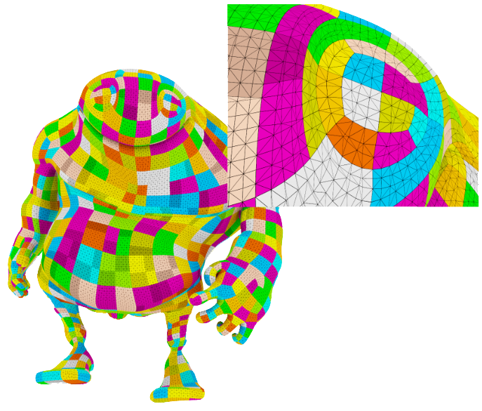
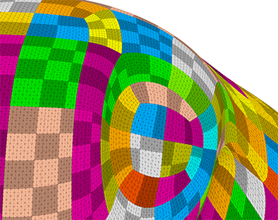
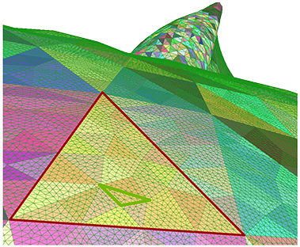
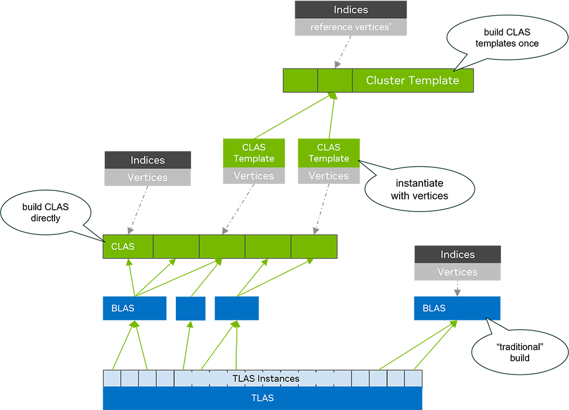


# Cluster Tessellation

RTX MG tessellates Catmull-Clark subdivision surfaces on the GPU each frame, packing the
result into structured clusters and rebuilding the ray-tracing acceleration structure in
real time. For scenes that exercise this path and how to run them, see
[README — Running the Sample](../README.md#running-the-sample).

> [!IMPORTANT]
> All tessellation in this sample is performed with generic compute shaders. The
> fixed-function tessellation hardware in the rasterization pipeline (Hull/Domain
> shaders) is not used here.
> See: [DirectX Graphics Pipeline](https://learn.microsoft.com/en-us/windows/uwp/graphics-concepts/graphics-pipeline)

## Structured clusters

Because Catmull-Clark surfaces are quad-based, a finite set of rectangular tile
topologies covers the entire output: all combinations of M×N micro-triangle resolutions
up to 8×8. Each tile is a regular grid of triangles — the set is determined at startup
and never changes. Above, each cluster the control cage was tiled into is drawn in its
own color, and the inset shows the micro-triangle grid inside them.

This finite, reusable topology set is what makes these **structured clusters**, as
opposed to **unstructured clusters** from photogrammetry or arbitrary triangle meshes
where no such finite set exists. RTX MG supports both paths; the tessellation path
exploits the structure, the Cluster LOD path works with unstructured clusters.

|  Quad cluster grids  |  Triangle cluster grids  |
| :---: | :---: |
|  |  |

## Cluster templates

The structured topology enables a significant BVH build optimization. On startup, each
tile configuration is passed to the CLAS template builder — NVAPI on D3D12 and
`VK_NV_cluster_acceleration_structure` on Vulkan — which produces a **cluster template**
containing a pre-optimized BVH treelet for that topology. Templates hold only the index
buffer; no vertex positions.

At render time, each tessellated cluster picks the template that matches its M×N edge
rate and supplies vertex positions. The BVH builder instantiates the template with those
positions at a fraction of the cost of a full build. This amortizes enormous amounts of
build work across every frame that reuses the same tile topology, giving build throughput
comparable to BVH refit while still allowing topology changes between frames.

> This template workflow has lower memory usage and more stable traversal performance
> than traditional refit. It requires that triangles within a cluster are near each
> other in space — the clustering quality matters.

## Frame pipeline

Each frame the tessellation path runs the following passes in order:

**1. Subdivision mesh animation.** Interpolate the control mesh (if animated). Limit
surface samples are computed inside the tessellation algorithm using the methods from
[Efficient GPU Rendering of Subdivision Surfaces using Adaptive Quadtrees](https://dl.acm.org/doi/10.1145/2897824.2925874)
(ACM TOG, Vol 35, Issue 4).

**2. Cluster tiling.** For each face of the control mesh:
- Sample the limit surface at the 4 corners and 4 edge mid-points, and apply
  displacement if present.
- Measure the projected edge lengths in screen space.
- Check frustum and Hierarchical Z-buffer visibility.
- Compute tessellation rates for the 4 edges.
- Split into cluster tiles (maximum 8×8) and emit a cluster list.

**3. Fill clusters.** For each cluster tile:
- Evaluate the limit surface at all micro-vertex positions.
- Compute surface tangents and normals analytically from polynomial-basis derivatives.
- Apply displacement.
- Emit vertex and texcoord buffers.

**4. CLAS instantiation.** For each cluster:
- Select the template matching the cluster's M×N edge rate.
- Fill a CLAS descriptor in GPU memory with the template ID and vertex-buffer pointers.
- Launch the template instantiation via NVAPI indirect / `VK_NV_cluster_acceleration_structure`.

**5. BLAS build.** Collect the CLAS pointers and build one BLAS per mesh.

**6. TLAS build.** Build the scene TLAS from per-instance BLAS addresses.

## Where the code lives

| stage | rtxmg |
| - | - |
| OpenSubdiv topology preprocessing | `extern/osd_lite`, `rtxmg/include/rtxmg/subdivision/osd_ports` |
| Subdivision plans + stencil tables | `rtxmg/subdivision/topology_map.cpp`, `topology_cache.cpp` |
| Subdivision surface, control mesh | `rtxmg/subdivision/subdivision_surface.cpp`, `shape.cpp` |
| Limit-surface evaluation (GPU) | `rtxmg/include/rtxmg/subdivision/subdivision_eval.hlsli` |
| Tessellator driver | `rtxmg/cluster_tess/cluster_tessellator.cpp` |
| Cluster tiling pass | `rtxmg/cluster_tess/shaders/compute_cluster_tiling.hlsl` |
| Fill clusters pass | `rtxmg/cluster_tess/shaders/fill_clusters.hlsl` |
| Displacement | `rtxmg/include/rtxmg/cluster_tess/displacement.hlsli` |
| CLAS templates + instantiation | `rtxmg/include/rtxmg/cluster_tess/cluster_tess_tilings.h`, `shaders/fill_instantiate_template_args.hlsl` |
| BLAS / TLAS build args | `rtxmg/cluster_tess/shaders/fill_blas_from_clas_args.hlsl`, `fill_instance_descs.hlsl` |
| Hierarchical Z-buffer | `rtxmg/hiz` |
