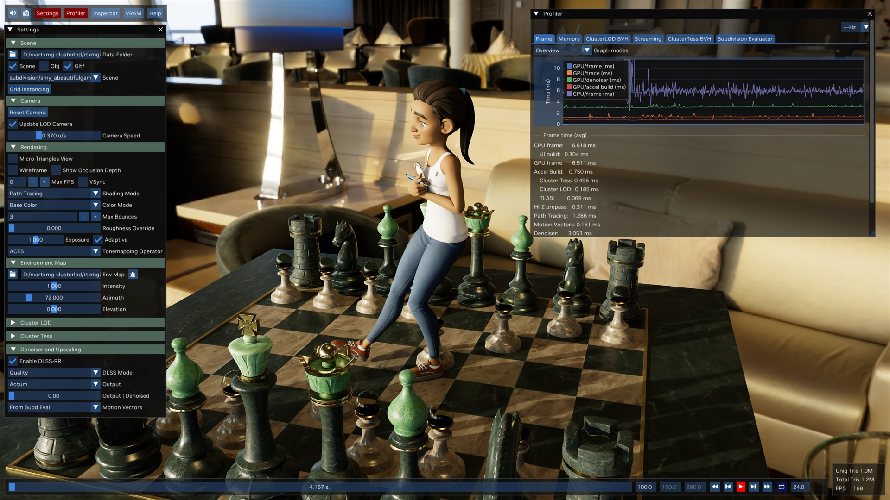
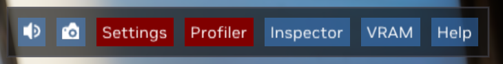
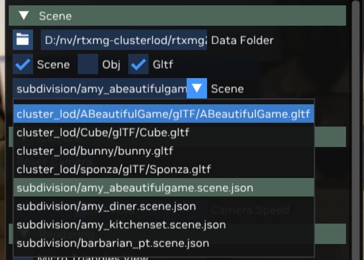
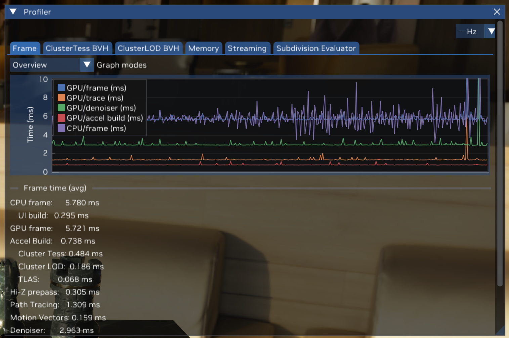

# Quick Start Guide

See [README](../README.md) for cloning, build steps, and the sample scenes. For algorithm
deep-dives see [ClusterTess.md](ClusterTess.md) and [ClusterLOD.md](ClusterLOD.md).

This guide covers how to explore the running application: the window layout, camera and
keyboard controls, and each of the tool windows.

---

## Window layout



The application draws a toolbar in the top-left corner and a Tris / FPS readout in the
bottom-right. Everything else is a window you open from the toolbar.



| toolbar button | opens |
| - | - |
| speaker | Mute audio |
| camera | Save a screenshot |
| **Settings** | All render and geometry settings (see below) |
| **Profiler** | Frame timings, memory and streaming |
| **Inspector** | Per-mesh geometry and residency stats |
| **VRAM** | The VRAM Budget window |
| **Help** | The keyboard / mouse reference, in-app |

A button is highlighted red while its window is open.

Every widget has a tooltip — hover it for a description of what it does and what values
are valid. Press **Esc** to hide the whole UI (and again to bring it back); the Tris /
FPS readout goes with it.

The bottom-right readout shows **Uniq Tris** (the CLAS-deduplicated triangle count in
the TLAS), **Total Tris** (the instanced sum) and **FPS**. On a scene with no Cluster LOD
geometry it shows a single **Tris** count instead.

An animated scene also gets a timeline across the bottom, with a scrubber and transport
controls for playback speed and looping.

---

## Loading a scene



The **Scene** section of the Settings window drives asset loading:

- **Data Folder** — the asset root, scanned on startup. Type a path or use the folder
  button. Equivalent to `--media <dir>`.
- **Scene** / **Obj** / **Gltf** checkboxes — which file types the browser lists.
- **Scene** pull-down — every asset found under the data folder. Picking one loads it.
- **Grid Instancing** — replicate the loaded model into a grid, which turns a small
  asset into a heavy scene.

Assets added to the folder hierarchy are picked up the next time the folder is rescanned
(changing the Data Folder or a type filter forces a rescan).

### Included scenes

| scene | geometry | what it demonstrates |
| - | - | - |
| `cluster_lod/ABeautifulGame/glTF/ABeautifulGame.gltf` | Cluster LOD | Pre-baked clusters, streaming, multiple materials and textures |
| `subdivision/amy_kitchenset.scene.json` | Cluster Tess | Adaptive tessellation of subdivision surfaces with displacement mapping |
| `subdivision/amy_diner.scene.json` | Cluster Tess | Diner environment with an animated character |
| `subdivision/barbarian_pt.scene.json` | Cluster Tess | Character model with displacement and PBR materials |
| `subdivision/amy_abeautifulgame.scene.json` | Mixed | Both geometry paths sharing one material table and one TLAS |

> [!NOTE]
> A glTF model runs an offline Cluster LOD bake on its first load, writing a cluster
> cache (`_nvsngeocache/`) next to the asset. Later loads memory-map the cache and skip
> the bake. See [ClusterLOD.md — Baking / LOD generation](ClusterLOD.md#baking--lod-generation).

The highest-fidelity scene is **Zorah**, downloaded separately — see
[README — Running the Sample](../README.md#running-the-sample).

---

## Camera and keyboard controls

The **Help** button opens this same table in-app, so it never goes stale.

| Camera | |
| - | - |
| W / S | Move forward / backward |
| A / D | Move left / right |
| Q / E | Move down / up |
| Z / X | Roll left / right |
| Shift (hold) | Move 3x faster |
| Ctrl (hold) | Move 10x finer |
| Alt (hold) | Orbit mode |
| F | Reset camera to the scene default |
| C | Print the camera parameters to stdout |
| / | Freeze / unfreeze the LOD camera |

| Mouse | |
| - | - |
| Left drag | Look around (or orbit with Alt) |
| Right click | Pick a mesh into the Inspector |
| Wheel | Adjust camera speed |
| Alt + wheel | Zoom |

| View | |
| - | - |
| 1 | Next shading mode |
| 2 / 4 | Next / previous color mode |
| 3 | Toggle wireframe |
| 5 | Next tonemapper |
| T | Toggle the time view |
| Left / Right | Decrease / increase max path bounces |

| Application | |
| - | - |
| Esc | Show / hide all UI |
| P | Save a screenshot |
| Shift + P | Save a screenshot with the UI |
| Ctrl + R | Reload shaders |
| Alt + F4 | Quit |

**Freezing the LOD camera** (`/`, or the *Update LOD Camera* checkbox) is the single most
useful debugging control: every view-dependent decision — Cluster LOD detail selection,
tessellation rate, frustum culling, HiZ occlusion — locks to the current viewpoint while
the render camera keeps moving, so you can fly around and look at what the renderer
actually chose.

---

## Settings window

Sections, top to bottom. A geometry section is greyed out when the loaded scene has no
geometry of that kind; hover it to see why.

- **Scene** — asset browser and data folder (above).
- **Camera** — Reset Camera, Update LOD Camera, and the Camera Speed slider (log scale;
  the mouse wheel drives it too).
- **Rendering** — Shading Mode, Color Mode, Max Bounces, exposure and tonemapping,
  wireframe and Micro Triangles View, Show Occlusion Depth, Max FPS / VSync, and the
  environment map.
- **Cluster LOD** — grouped into *Shading* (Vertex Normals, Shading Normals, Normal
  Maps), *LOD / Culling* (LOD Pixel Error and its Adaptive checkbox, the Culling mode,
  HiZ occlusion, Culled error scale) and *BLAS Reuse* (Sharing, Caching, Merging plus
  their tail-level sliders). The **Bake Config** button at the top opens the bake
  settings window. See [ClusterLOD.md](ClusterLOD.md) for what each control does.
- **Cluster Tess** — Tess Pattern, Vertex Normals, the Frustum / HiZ / Backface
  visibility predicates, Fine | Coarse Tess Rate, Tessellation Metric, Visibility Mode,
  Global Isolation Level and Displacement Scale. See [ClusterTess.md](ClusterTess.md).
- **Denoiser and Upscaling** — DLSS-RR on/off, DLSS mode, and what the output buffer
  shows.

---

## Inspector


**Right-click a surface in the viewport** to select its geometry. With *Highlight
Selection* ticked the picked mesh is tinted in the viewport, and the Inspector scrolls to
its row and expands it.

**Selected Mesh** breaks the pick down two ways:

- *Mesh Memory* — per channel (positions, normals, UVs), what is resident on the device
  versus what the shard holds on disk. Positions read 0 B resident because they are
  fetched straight out of the acceleration structure.
- *Residency* — resident versus total groups, clusters, triangles, and how many bytes of
  CLAS have been built.

**Cluster LOD Meshes** lists every geometry in the scene, sortable by any column
(resident %, resident memory, disk size, CLAS, groups, clusters, triangles), with a Total
row at the top. Expanding a mesh shows one row per LOD level: how much of that level is
resident, and what it costs. Coarse levels typically sit at 100% or read `cached` — they
are cheap and always kept — while fine levels stream in and out as the camera moves.

Subdivision scenes get a **Subdivision Meshes** section instead, with per-mesh surface,
patch and sharpness counts.

---

## Profiler



Tabs appear only when the scene contains the relevant geometry:

| tab | shows |
| - | - |
| **Frame** | Frame time graph plus an average breakdown: CPU and GPU frame, accel build, path tracing, motion vectors, denoiser, blit, and what is unaccounted for. |
| **ClusterTess BVH** | Per-pass breakdown of the tessellation path's BVH build: tiling, fill, CLAS instantiation, BLAS build. |
| **ClusterLOD BVH** | Per-pass breakdown of the Cluster LOD path's BVH build: traversal, BLAS builds, TLAS. |
| **Memory** | GPU memory by category, with high-water marks. |
| **Streaming** | Cluster LOD residency and transfer: pool occupancy, resident group and cluster counts, load/unload rates, and BLAS reuse statistics. |
| **Subdivision Evaluator** | Topology-map data for the loaded subdivision meshes: surface tables and their memory cost, patch composition, and a warning when a mesh's topology is poor for evaluation. |

The **Hz** pull-down in the top-right sets how often samples are recorded (`---Hz`
records every frame). Hovering the graph gives exact per-timer numbers for that sample.

If the CPU frame line sits above the GPU frame line, the frame is CPU-bound.

---

## VRAM Budget window


The header names the card and its total VRAM, and the OS budget — how much of it this
process is actually allowed. Three bars follow:

- **Allocated** — VRAM the driver has handed over so far.
- **Current Budget** — what the applied budgets permit.
- **Pending Budget** — what the staged edits would permit.

**Buckets** breaks both down per category — textures, the Cluster LOD geometry, CLAS,
cached BLAS and metadata pools, BLAS scratch, render targets, and an *Unaccounted*
remainder that covers DLSS, NVRHI and driver allocations the sample cannot attribute. The
pools that track occupancy draw a fill bar; the rest just report a size.

Below that are the editable budgets, grouped into **Textures**, **Cluster LOD** and
**Cluster Tess**. Edits are staged, not live: changed fields highlight, and the footer
says what **Apply** will do.

- Pool budgets **reallocate and re-stream** without dropping the scene.
- Texture budget and *Load Normal Maps* **reload the scene**, because they decide what is
  read off disk. Apply asks for confirmation first.
- **Revert** drops the staged edits.
- **Reset streaming state** evicts everything and re-streams the current view with the
  budgets already applied — a quick way to watch a scene stream in from scratch.

See [ClusterLOD.md — Streaming budgets](ClusterLOD.md#streaming-budgets) for what each
control bounds and its command-line equivalent.

If a budget is too small for the frame, a red banner appears at the top of the viewport —
*Render cluster budget exceeded*, *Tessellation memory budget exceeded* or *Traversal
queue capacity exceeded* — with an **Adjust VRAM Budget** button that opens this window.
Expect flickering until it is resolved.

---

## Bake Config window


Opened from the **Bake Config** button in the Settings window's Cluster LOD section, this
edits how the LOD hierarchy is built: cluster and group sizes, the LOD node width,
simplification weights, LOD error metric, meshoptimizer tuning, and vertex compression.
The header shows which cache directory and `bake_config.json` the settings belong to.

Changed fields are highlighted. **Apply** lists every delta and warns before committing,
because new bake settings **invalidate the cluster cache** — the scene reloads and
re-bakes, which on a large asset takes a while. Cancel discards the edits.

After a bake the **Bake Report** window summarizes it: bake time, worker count, peak RAM
delta, and before/after geometry stats when it replaced an existing cache.

---

## Learning more

| topic | document |
| - | - |
| Cluster tessellation algorithm, cluster templates, frame pipeline | [ClusterTess.md](ClusterTess.md) |
| Cluster LOD hierarchy, streaming, BLAS reuse, culling | [ClusterLOD.md](ClusterLOD.md) |
| Validation, GPU crash dumps, diagnostic flags | [DEBUGGING.md](DEBUGGING.md) |

---

## Appendix

### OBJ extensions

RTX MG uses an extended version of Autodesk's OBJ format with a tag system for
subdivision surface data. The tag syntax is:

```
t <tag name> <num int args>/<num float args>/<num string args> <args>
```

Examples:

```
# vertex boundary interpolation: VTX_BOUNDARY_EDGE_AND_CORNER
t interpolateboundary 1/0/0 1

# face-varying boundary interpolation: FVAR_LINEAR_ALL
t interpolateboundary 1/0/0 5

# edge crease (vertices 1–3, sharpness 2.0)
t crease 2/1/0 1 3 2.0

# vertex corner (vertex 4, sharpness 2.8)
t corner 1/1/0 4 2.8

# hole face
t hole 1/0/0 9

# crease method
t creasemethod 0/0/1 chaikin
```

This is the same tagging system used by
[OpenSubdiv](https://graphics.pixar.com/opensubdiv/docs/intro.html).

### MTL extensions

The OBJ parser supports the physically based rendering (PBR) MTL extensions:

```
Kd        albedo
Ks        specular
Pr        roughness
Pm        metalness
map_Kd    albedo map
map_Ks    specular map
map_Pr    roughness map
map_Bump -bm <scale> -bb <bias>    displacement map
```

Transparent, transmissive, and emissive materials are parsed but not rendered.

### UDIM workflows

UDIM texture naming with the `<UDIM>` keyword is supported:

```
map_Kd textures/asset_name_D.<UDIM>.dds
```

> [!IMPORTANT]
> UV islands must not cross UDIM tile boundaries. A crossing face is bound to the tile
> its first vertex lands in and logs a warning; the out-of-tile part samples the wrong
> tile.

### JSON scene files

Multiple assets can be combined with Donut's JSON scene format. Scene files carry the
`.scene.json` extension and should be placed under the `assets/` root (all asset paths
are relative to the scene file's location).

> [!NOTE]
> glTF/GLB models cannot represent subdivision surfaces, so a `.gltf` or `.glb` model
> always takes the [Cluster LOD path](ClusterLOD.md), and a `.scene.json` that
> references both file types renders each model on the path its format implies.
